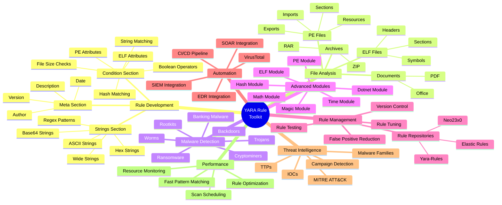

<div align="center">
    <p align="center">
        <a href="https://wikipedia.org/wiki/YARA">
          
        </a>
    </p>



# **`Awesome`** [YARA](https://wikipedia.org/wiki/YARA) [](https://awesome.re)
</div>

[](https://youtube.com/playlist?list=PLCYvMfK6Rps4&si=JfYQvPC03T1q1KJm)
[](https://www.reddit.com/r/antivirus/new/)

<p align="center">
    <a href="https://github.com/cybersecurity-dev/"></a>
    &nbsp;
    <a href="https://www.youtube.com/@CyberThreatDefense"></a>
    &nbsp;
    <a href="https://cyberthreatdefence.com/my_awesome_lists"></a>
    
</p>

## 📖 Contents
- [YARA Rules](#yara-rules)
- [YARA-X](#yara-x)
- [Tools](#tools)
- [My Other Awesome Lists](#my-other-awesome-lists)
- [Contributing](#contributing)
- [Contributors](#contributors)


```text
YARA Toolkit
│
├── Rule Authoring
│   ├── Meta
│   ├── Strings
│   └── Conditions
│
├── Analysis Targets
│   ├── PE
│   ├── ELF
│   ├── APK
│   ├── Office
│   ├── PDF
│   └── Memory Dump
│
├── Modules
│   ├── PE
│   ├── ELF
│   ├── Hash
│   ├── Math
│   ├── Time
│   ├── DotNet
│   └── Magic
│
├── Detection Operations
│   ├── Malware Detection
│   ├── Threat Hunting
│   ├── Incident Response
│   ├── IOC Matching
│   └── Memory Scanning
│
├── Automation
│   ├── EDR
│   ├── SIEM
│   ├── SOAR
│   ├── CI/CD
│   └── Threat Intel Feeds
│
└── Ecosystem Tools
    ├── yara
    ├── yarac
    ├── Loki
    ├── THOR
    ├── Velociraptor
    ├── VirusTotal
    └── Sigma2YARA
```

## [YARA](https://github.com/VirusTotal/yara) [Rules](https://yara.readthedocs.io/en/latest/)
- [DefenderYara](https://github.com/roadwy/DefenderYara) - Extracted Yara rules from Windows Defender mpavbase and mpasbase.
- [fsYara](https://github.com/filescanio/fsYara) - A collection of curated YARA rules used as part of the [Filescan.io](https://www.filescan.io/) service.
- [InQuest](https://github.com/InQuest/yara-rules) - A collection of YARA rules we wish to share with the world, most probably referenced from [http://blog.inquest.net](http://blog.inquest.net).
- [Signature-Base](https://github.com/Neo23x0/signature-base) - Signature-Base is the [YARA](https://virustotal.github.io/yara/) signature and IOC database for our scanners [LOKI](https://github.com/Neo23x0/Loki) and [THOR Lite](https://www.nextron-systems.com/thor-lite/).

### [YARA-X](https://github.com/VirusTotal/yara-x)
- [YARA-X](https://github.com/VirusTotal/yara-x) - [YARA-X](https://virustotal.github.io/yara-x/blog/) is a re-incarnation of YARA, a pattern matching tool designed with malware researchers in mind. This new incarnation intends to be faster, safer and more user-friendly than its predecessor. The ultimate goal of [YARA-X](https://virustotal.github.io/yara-x/) is replacing YARA as the default pattern matching tool for malware researchers.

### Tools
- [Base64 Regular Expression Generator](https://labs.inquest.net/tools/yara/b64-regexp-generator) - YARA, Base64 Regular Expression Generator.
- [CIDR Block RegEx Generator](https://labs.inquest.net/tools/yara/iq-cidr2regexp) - YARA, CIDR Block RegEx Generator.
- [Mixed Hex Case Generator](https://labs.inquest.net/tools/yara/iq-mixed-case) - YARA, Mixed Hex Case Generator.
- [UInt() Trigger Generator](https://labs.inquest.net/tools/yara/iq-uint-trigger) - YARA, UInt() Trigger Generator.

##

### My Other Awesome Lists
You can access the my other awesome lists [here](https://cyberthreatdefence.com/my_awesome_lists)

### Contributing
[Contributions of any kind welcome, just follow the guidelines](contributing.md)!

### Contributors
[Thanks goes to these contributors](https://github.com/cybersecurity-dev/awesome-yara/graphs/contributors)!

### License
[](http://creativecommons.org/publicdomain/zero/1.0)

[🔼 Back to top](#awesome-yara-)
